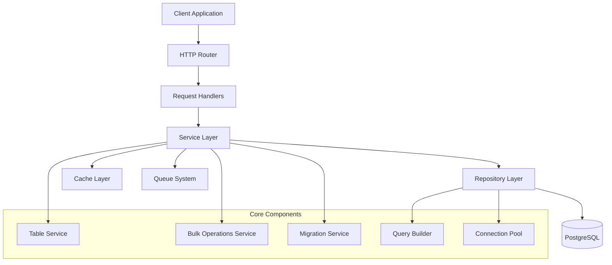
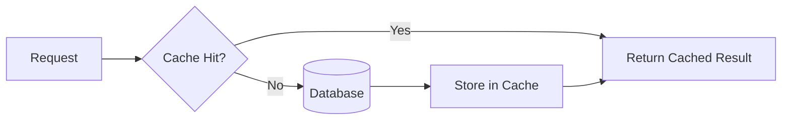
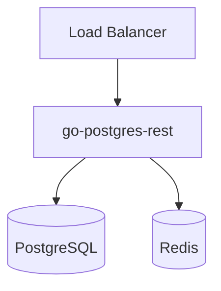
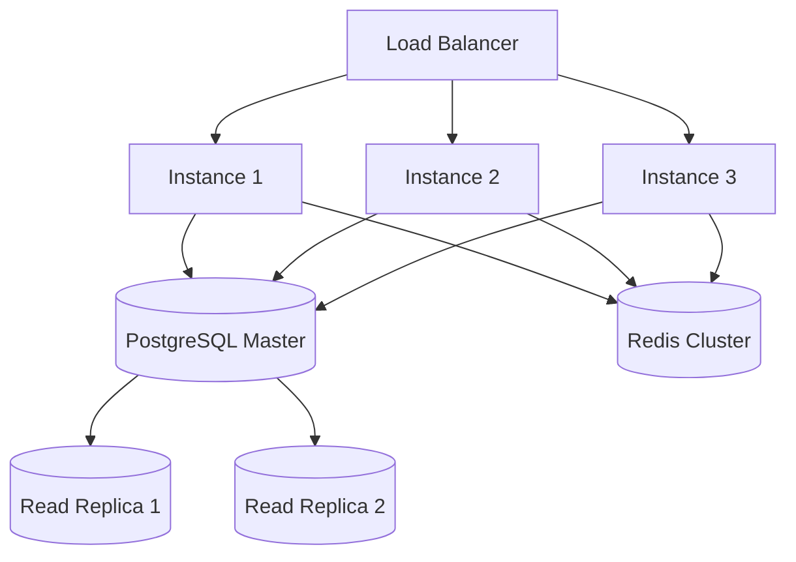

# Architecture Overview

This document provides a comprehensive overview of the go-postgres-rest architecture, design principles, and component interactions.

## Design Philosophy

go-postgres-rest is built on the following core principles:

1. **Type Safety**: Leverage Go's type system to prevent runtime errors
2. **Performance**: Optimize for high-throughput database operations
3. **Simplicity**: Minimize boilerplate while maintaining flexibility
4. **Reliability**: Handle edge cases and provide comprehensive error handling
5. **Extensibility**: Allow customization without breaking core functionality

## High-Level Architecture



## Core Components

### 1. Service Layer

The service layer provides the main API interface and business logic:

#### Table Service
- **Purpose**: CRUD operations on individual tables
- **Location**: `pkg/services/table.go`
- **Key Methods**:
  - `Insert(ctx, data)`: Create new records
  - `FindAll(ctx, options)`: Query records with filtering
  - `Update(ctx, id, data)`: Update existing records
  - `Delete(ctx, id)`: Remove records

#### Bulk Operations Service
- **Purpose**: High-performance batch operations
- **Location**: `pkg/services/bulk.go`
- **Key Methods**:
  - `BulkInsert(ctx, records)`: Insert multiple records in single transaction
  - `BulkUpdate(ctx, updates)`: Update multiple records efficiently
  - `Upsert(ctx, records)`: Insert or update on conflict

#### Migration Service
- **Purpose**: Schema management and migrations
- **Location**: `pkg/services/migration.go`
- **Key Methods**:
  - `CreateTable(ctx, schema)`: Create tables with proper constraints
  - `AlterTable(ctx, changes)`: Modify existing table structure
  - `RunMigration(ctx, migration)`: Execute migration scripts

### 2. Repository Layer

The repository layer handles direct database interactions:

#### Query Builder
- **Purpose**: Programmatic SQL query construction
- **Location**: `pkg/repository/query_builder.go`
- **Features**:
  - Type-safe query building
  - Complex WHERE clauses with AND/OR logic
  - JOIN operations (INNER, LEFT, RIGHT, FULL OUTER)
  - Aggregations and GROUP BY
  - Subquery support

```go
query := builder.NewQuery().
    Table("users").
    Select("id", "name", "email").
    Where("active", "=", true).
    Join("profiles", "users.id = profiles.user_id").
    OrderBy("created_at", "DESC").
    Limit(50)
```

#### Connection Management
- **Purpose**: Database connection lifecycle management
- **Location**: `pkg/repository/connection.go`
- **Features**:
  - Connection pooling with configurable limits
  - Health checks and automatic reconnection
  - Context-based query cancellation
  - Transaction management

### 3. Configuration System

Hierarchical configuration management supporting multiple sources:

```go
type Config struct {
    Database DatabaseConfig `yaml:"database"`
    Server   ServerConfig   `yaml:"server"`
    Cache    CacheConfig    `yaml:"cache"`
    Logging  LoggingConfig  `yaml:"logging"`
}
```

**Configuration Sources** (in order of precedence):
1. Command line flags
2. Environment variables
3. Configuration files (`config.yaml`, `.env`)
4. Default values

### 4. Error Handling

Comprehensive error handling with structured error types:

```go
type DBError struct {
    Code    string `json:"code"`
    Message string `json:"message"`
    Details map[string]interface{} `json:"details,omitempty"`
    Cause   error  `json:"-"`
}
```

**Error Categories**:
- `CONNECTION_ERROR`: Database connectivity issues
- `VALIDATION_ERROR`: Data validation failures
- `CONSTRAINT_ERROR`: Database constraint violations
- `NOT_FOUND_ERROR`: Resource not found
- `PERMISSION_ERROR`: Access control violations

## Performance Optimizations

### 1. Connection Pooling

```go
poolConfig := pgxpool.Config{
    MaxConns:        30,
    MinConns:        5,
    MaxConnLifetime: time.Hour,
    MaxConnIdleTime: time.Minute * 30,
}
```

### 2. Query Optimization

- **Prepared Statements**: Automatic statement preparation for repeated queries
- **Batch Operations**: Group multiple operations into single round-trips
- **Index Hints**: Automatic index creation suggestions
- **Query Analysis**: Built-in query performance monitoring

### 3. Caching Strategy



## Security Architecture

### 1. SQL Injection Prevention
- All queries use parameterized statements
- Input validation with type checking
- Query builder prevents string concatenation

### 2. Connection Security
- SSL/TLS encryption for database connections
- Certificate validation
- Configurable cipher suites

### 3. Access Control
- Role-based permissions
- Table-level access controls
- Audit logging

## Transaction Management

```go
err = pgClient.WithTransaction(ctx, func(tx *sql.Tx) error {
    // Multiple operations within single transaction
    if err := tx.CreateUser(user); err != nil {
        return err // Transaction will rollback
    }
    
    if err := tx.CreateProfile(profile); err != nil {
        return err // Transaction will rollback
    }
    
    return nil // Transaction will commit
})
```

## Monitoring and Observability

### Metrics Collection
- Query execution times
- Connection pool statistics
- Error rates by category
- Throughput metrics

### Logging
- Structured logging with configurable levels
- Request tracing with correlation IDs
- Slow query logging
- Error stack traces in development

### Health Checks
- Database connectivity verification
- Connection pool health
- Migration status
- Dependency checks

## Extension Points

### Custom Middleware
```go
func AuthMiddleware(next HandlerFunc) HandlerFunc {
    return func(ctx context.Context, req *Request) (*Response, error) {
        // Authentication logic
        return next(ctx, req)
    }
}
```

### Custom Validators
```go
type EmailValidator struct{}

func (v EmailValidator) Validate(value interface{}) error {
    // Custom validation logic
}
```

### Plugin System
Support for external plugins to extend functionality:
- Custom field types
- Additional databases
- External cache providers
- Custom authentication providers

## Deployment Architecture

### Single Instance


### High Availability


## Best Practices

### 1. Resource Management
- Always use context for cancellation
- Close database connections properly
- Implement proper connection pooling limits

### 2. Error Handling
- Use structured error types
- Provide meaningful error messages
- Log errors with appropriate context

### 3. Performance
- Use bulk operations for large datasets
- Implement proper indexing strategies
- Monitor query performance regularly

### 4. Security
- Validate all inputs
- Use parameterized queries
- Implement proper access controls
- Keep dependencies updated